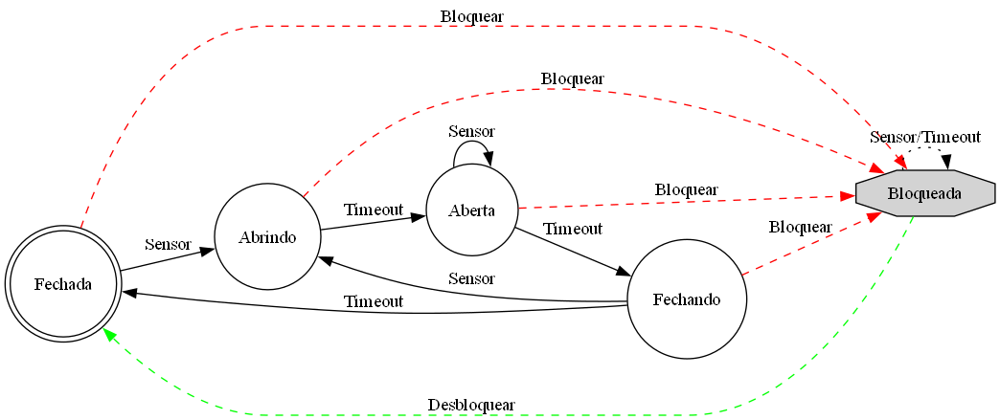
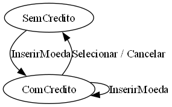

# Máquinas de Estados Finitos em Haskell
## Trabalho Prático - 6º Ciclo

**Autor:** Arthur da Silva Leal  
**Repositório:** [github.com/arthurdasilvaleal/TrabalhoHaskell](https://github.com/arthurdasilvaleal/TrabalhoHaskell)

---

## O que é uma FSM (Máquina de Estados Finitos)?

Uma **Máquina de Estados Finitos** é um modelo matemático de computação que:

- Possui um **número finito de estados**
- Está em **exatamente um estado** por vez
- Muda de estado em resposta a **entradas externas**
- Produz **saídas** baseadas nas transições

### Aplicações no mundo real:
- Semáforos de trânsito
- Portas automáticas
- Máquinas de venda
- Protocolos de rede
- Jogos (comportamento de NPCs)

---

## Estrutura do Projeto

```
fsm-haskell/
├── src/
│   └── FSM.hs          # Biblioteca FSM genérica
├── app/
│   └── Main.hs         # Exemplos e testes
├── diagram/
│   ├── porta_automatica.dot   # Diagrama GraphViz
│   ├── porta_automatica.png   # Imagem do diagrama
│   ├── vending_machine.dot
│   └── vending_machine.png
└── README.md
```

---

## A Biblioteca FSM (src/FSM.hs)

### Tipo principal:
```haskell
newtype FSM s i o = FSM { step :: s -> i -> (s, o) }
```

- `s` → tipo do **estado**
- `i` → tipo da **entrada**
- `o` → tipo da **saída**

### Funções disponíveis:
| Função | Descrição |
|--------|-----------|
| `step` | Executa um passo da FSM |
| `runFSM` | Executa lista de entradas, retorna estado final |
| `runFSMWithOutputs` | Executa e coleta todos os estados/saídas |
| `composeFSMs` | Compõe duas FSMs em paralelo |

---

## Exemplo 1: Porta Automática

### Estados:
- `Fechada` → Porta totalmente fechada
- `Abrindo` → Em processo de abertura
- `Aberta` → Porta totalmente aberta
- `Fechando` → Em processo de fechamento
- `Bloqueada` → Emergência/manutenção

### Entradas:
- `Sensor` → Detecta presença
- `Timeout` → Tempo expirado
- `Bloquear` / `Desbloquear`

---

## Diagrama: Porta Automática



### Transições principais:
```
Fechada --[Sensor]--> Abrindo --[Timeout]--> Aberta
Aberta --[Timeout]--> Fechando --[Timeout]--> Fechada
Fechando --[Sensor]--> Abrindo (reabre!)
Qualquer --[Bloquear]--> Bloqueada
Bloqueada --[Desbloquear]--> Fechada
```

---

## Código: Porta Automática

```haskell
data PortaState = Fechada | Abrindo | Aberta 
                | Fechando | Bloqueada

portaAutomatica :: FSM PortaState PortaInput PortaOutput
portaAutomatica = FSM $ \s input -> case (s, input) of
  (_, Bloquear) -> (Bloqueada, Status "Porta bloqueada")
  (Bloqueada, Desbloquear) -> (Fechada, Status "Desbloqueada")
  (Fechada, Sensor) -> (Abrindo, Status "Abrindo porta")
  (Abrindo, Timeout) -> (Aberta, Status "Porta aberta")
  (Aberta, Timeout) -> (Fechando, Status "Fechando porta")
  (Aberta, Sensor) -> (Aberta, Status "Mantendo aberta")
  (Fechando, Sensor) -> (Abrindo, Status "Reabrindo")
  (Fechando, Timeout) -> (Fechada, Status "Porta fechada")
  (_, _) -> (s, Status "Sem alteração")
```

---

## Exemplo 2: Máquina de Venda

### Estados:
- `SemCredito` → Nenhum valor inserido
- `ComCredito Int` → Valor acumulado

### Entradas:
- `InserirMoeda Int` → Adiciona crédito
- `Selecionar` → Tenta comprar (custo: 2 unidades)
- `Cancelar` → Devolve crédito

### Saídas:
- Mensagens descritivas do que aconteceu

---

## Diagrama: Máquina de Venda



### Fluxo típico:
```
SemCredito --[InserirMoeda 1]--> ComCredito 1
ComCredito 1 --[InserirMoeda 1]--> ComCredito 2
ComCredito 2 --[Selecionar]--> SemCredito (Dispensado! Troco: 0)
```

---

## Código: Máquina de Venda

```haskell
data VMState = SemCredito | ComCredito Int

maquinaVenda :: FSM VMState VMInput VMOutput
maquinaVenda = FSM $ \s input -> case (s, input) of
  (SemCredito, InserirMoeda n) -> 
    (ComCredito n, Mensagem $ "Inserido: " ++ show n)
  (ComCredito c, InserirMoeda n) -> 
    (ComCredito (c+n), Mensagem $ "Total: " ++ show (c+n))
  (ComCredito c, Selecionar) -> 
    if c >= 2
    then (SemCredito, Mensagem $ "Dispensado. Troco: " ++ show (c-2))
    else (ComCredito c, Mensagem "Crédito insuficiente")
  (ComCredito c, Cancelar) -> 
    (SemCredito, Mensagem $ "Devolvido: " ++ show c)
  (SemCredito, _) -> (SemCredito, Mensagem "Sem crédito")
```

---

## Composição de FSMs

A função `composeFSMs` permite executar **duas FSMs em paralelo**:

```haskell
composeFSMs :: FSM s1 i o1 -> FSM s2 i o2 
            -> FSM (s1, s2) i (o1, o2)
```

### Exemplo: Duas portas automáticas
```haskell
let composed = composeFSMs portaAutomatica portaAutomatica
    resultado = runFSMWithOutputs composed 
                  (Fechada, Aberta) [Sensor, Timeout, Bloquear]
```

### Utilidade:
- Modelar sistemas com múltiplos componentes
- Sincronizar comportamentos
- Ex: interseção com dois semáforos

---

## Demonstração: Execução

```
Demonstração da porta automática (ciclo normal)
Inicial: Fechada
  -> estado: Abrindo, saída: "Sensor detectado: Abrindo porta"
  -> estado: Aberta, saída: "Porta totalmente aberta"
  -> estado: Fechando, saída: "Tempo expirado: Fechando porta"
  -> estado: Fechada, saída: "Porta totalmente fechada"
```

```
Demonstração da máquina de venda
Inicial: SemCredito
  -> estado: ComCredito 1, saída: "Inserido: 1"
  -> estado: ComCredito 2, saída: "Total inserido: 2"
  -> estado: SemCredito, saída: "Dispensado. Troco: 0"
```

---

## Testes Implementados

### Porta Automática:
- ✅ Ciclo normal (abrir → fechar)
- ✅ Sensor durante fechamento (reabre)
- ✅ Bloqueio/desbloqueio
- ✅ Múltiplos sensores mantêm aberta
- ✅ Timeout ignorado quando bloqueada

### Máquina de Venda:
- ✅ Compra com crédito exato
- ✅ Compra com troco
- ✅ Crédito insuficiente
- ✅ Cancelamento
- ✅ Operações sem crédito

---

## Por que Haskell para FSMs?

### Vantagens:
1. **Pureza**: função `step` é pura, fácil de testar
2. **Tipos algébricos**: estados e entradas são claros
3. **Pattern matching**: transições legíveis
4. **Composição**: `composeFSMs` é natural
5. **Imutabilidade**: sem efeitos colaterais inesperados

### Desvantagens:
- Curva de aprendizado
- Integração com IO requer adaptação (ex: `StateT`)

---

## Extensões Possíveis

1. **Transformar em State Monad** — integrar com IO
2. **Adicionar validação** — rejeitar transições inválidas
3. **Serialização** — salvar/carregar estado
4. **Visualização em tempo real** — GUI para ver transições
5. **Mais FSMs** — elevador, semáforo, protocolo TCP

---

## Como Executar

```powershell
# Clonar o repositório
git clone https://github.com/arthurdasilvaleal/TrabalhoHaskell.git
cd TrabalhoHaskell/fsm-haskell

# Executar sem compilar
runghc -isrc app/Main.hs

# Ou compilar e executar
ghc -isrc app/Main.hs -o fsm-demo
./fsm-demo.exe
```

---

## Conclusão

- FSMs são um **modelo poderoso** para sistemas reativos
- Haskell oferece **expressividade** para implementá-las
- O projeto demonstra **dois exemplos práticos**
- **Composição** permite modelar sistemas complexos
- **Testes** garantem comportamento correto

### Obrigado!

**Repositório:** [github.com/arthurdasilvaleal/TrabalhoHaskell](https://github.com/arthurdasilvaleal/TrabalhoHaskell)

---

## Referências

- [Haskell Wiki - State Machines](https://wiki.haskell.org/State_machines)
- [Learn You a Haskell - Types](http://learnyouahaskell.com/types-and-typeclasses)
- [GraphViz Documentation](https://graphviz.org/documentation/)
- Slides criados com Markdown (compatível com Marp/Reveal.js)
